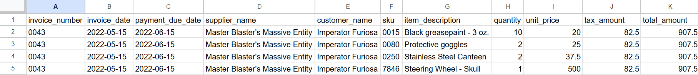

# ParserData + n8n: Email Invoices to Google Sheets

This repository contains an n8n workflow that automatically:

1. Watches a Gmail inbox for new emails with invoice PDF, PNG, jPG attachments  
2. Sends each invoice to the ParserData API  
3. Normalizes the response into one item per invoice line item  
4. Appends each line item as a new row into a Google Sheet  

It's a complete “Email → Structured data in Sheets” pipeline for invoices.

## Official ParserData pages

- **Official workflow page:** https://parserdata.com/integrations/n8n/email-invoice-extractor
- **n8n integration hub:** https://parserdata.com/integrations/n8n
- **API reference:** https://parserdata.com/parserdata-api
- **Pricing:** https://parserdata.com/pricing

---

## Overview

**Workflow name:** `Parserdata - Email to Google Sheets (Invoices)`

Nodes:

1. **Gmail Trigger**: polls Gmail for new messages and downloads attachments  
2. **HTTP Request (Parserdata Extract)**: sends the invoice PDF to Parserdata  
3. **Code in JavaScript**: expands Parserdata's response into one item per line item  
4. **Google Sheets – Append Row**: writes each line to a Google Sheet

The workflow JSON in this repo is ready to import into n8n. All credentials and IDs you can configure in your own instance.

---

## Prerequisites

To run this example you need:

- An **n8n** instance (self-hosted or cloud)
- A **Parserdata** account and an **API key**
- A **Google account** with:
  - Gmail enabled
  - Access to the Google Sheet where data will be written
- At least one **invoice** you can email as a test

Invoice example:

---

## Google Sheet Setup

1. Create a new Google Sheet.
2. In the first row, add these column headers (one per column, left to right):

   - `invoice_number`
   - `invoice_date`
   - `due_date`
   - `supplier_name`
   - `customer_name`
   - `sku`
   - `item_description`
   - `quantity`
   - `unit_price`
   - `tax_amount`
   - `total_amount`

3. Copy the **Spreadsheet ID** from the URL.  
   It looks like: `https://docs.google.com/spreadsheets/d/SPREADSHEET_ID/edit#gid=0`  
   You’ll paste `SPREADSHEET_ID` into the workflow later.

---

## Importing the Workflow into n8n

1. Download the `workflow.json` file from this repository.
2. In n8n, go to **Workflows → Import from File**.
3. Select `workflow.json` and import.
4. Open the imported workflow and you'll see the 4 nodes:

   - **Gmail Trigger**
   - **HTTP Request (Parserdata Extract)**
   - **Code in JavaScript**
   - **Google Sheets - Append Row**

---

## Configuring Credentials and Placeholders

After importing, you must connect your own credentials and IDs.

### 1. Gmail Trigger

- Open **Gmail Trigger** node.
- Select or create a **Gmail OAuth2** credential.
- Make sure **Download Attachments** is enabled.
- Optionally set filters (labels, from addresses, subject, etc.) so only invoice emails are processed.

The workflow assumes the first attachment is the invoice and exposes it as `attachment_0` for the Parserdata node.

---

### 2. Parserdata HTTP Request Node

Node: **HTTP Request (Parserdata Extract)**

This node:

- Sends a `POST` request to `https://api.parserdata.com/v1/extract`
- Uses **HTTP Header Auth** (configured as n8n credentials)
- Uploads the invoice as `file`
- Sends a detailed prompt defining the JSON structure

Steps:

1. In n8n, create an **HTTP Header Auth** credential for Parserdata:
   - Header name: according to Parserdata docs (for example `Authorization`)
   - Header value: something like `Bearer YOUR_PARSERDATA_API_KEY`
2. In the **HTTP Request** node, pick that credential in **Authentication → Generic Credential Type → HTTP Header Auth**.
3. Keep the **Content Type** as `multipart-form-data`.
4. Confirm the **file** field is configured as:
   - Parameter type: `Form-Data (Binary)`
   - Name: `file`
   - Input Data Field Name: `attachment_0`

The prompt already tells Parserdata which fields to extract and how to structure the response.

---

### 3. JavaScript Code Node

Node: **Code in JavaScript**

This node:

- Takes the Parserdata response
- Reads `result` (the header-level data)
- Iterates through `result.line_items`
- Returns one n8n item per line item, duplicating invoice-level fields on each item

You generally don't need to change this unless you want to add/remove fields.

Key mapping:

- Invoice-level fields:
  - `invoice_number`
  - `invoice_date`
  - `due_date`
  - `supplier_name`
  - `customer_name`
  - `net_amount`
  - `tax_amount`
  - `total_amount`
- Line-level fields:
  - `sku`
  - `item_description`
  - `quantity`
  - `unit_price`
  - `line_total`

---

### 4. Google Sheets – Append Row

Node: **Google Sheets - Append Row**

This node appends each line item as a row.

Configuration steps:

1. Select or create a **Google Sheets OAuth2** credential.
2. In **Spreadsheet**, use your actual Spreadsheet ID (the one from the URL).
3. Use the right sheet (for example `Sheet1` / `gid=0`).
4. The fields in the workflow are already mapped:

   - `invoice_number` → `={{ $json.invoice_number }}`
   - `invoice_date` → `={{ $json.invoice_date }}`
   - `payment_due_date` → `={{ $json.due_date }}`
   - `supplier_name` → `={{ $json.supplier_name }}`
   - `customer_name` → `={{ $json.customer_name }}`
   - `sku` → `={{ $json.sku }}`
   - `item_description` → `={{ $json.item_description }}`
   - `quantity` → `={{ $json.quantity }}`
   - `unit_price` → `={{ $json.unit_price }}`
   - `tax_amount` → `={{ $json.tax_amount }}`
   - `total_amount` → `={{ $json.total_amount }}`

You can customize the columns and mappings as needed.

---

## End-to-End Test

1. **Activate** the workflow in n8n.
2. Send an email to the watched Gmail address with an invoice attached.
3. Wait for the poll interval (or click **Execute Workflow** manually for a test).
4. Open the Google Sheet:
   - You should see one row **per line item** from the invoice.
   - Invoice-level fields will repeat for each row.

If nothing appears, check:

- Execution logs in n8n
- That the email has at least one invoice attachment
- That credentials for Gmail, Parserdata, and Google Sheets are all connected

---

## Customization Ideas

- Filter Gmail by **label** (e.g. only process emails in `Invoices`).
- Change the **Parserdata prompt** to extract additional fields.
- Add a **Slack** or **email** notification for new invoices above a threshold amount.

---

## Support

If you run into issues:

- Open a GitHub issue in this repository, or
- Reach out via the ParserData support email: support@parserdata.com.

Happy automating!

## License

MIT
